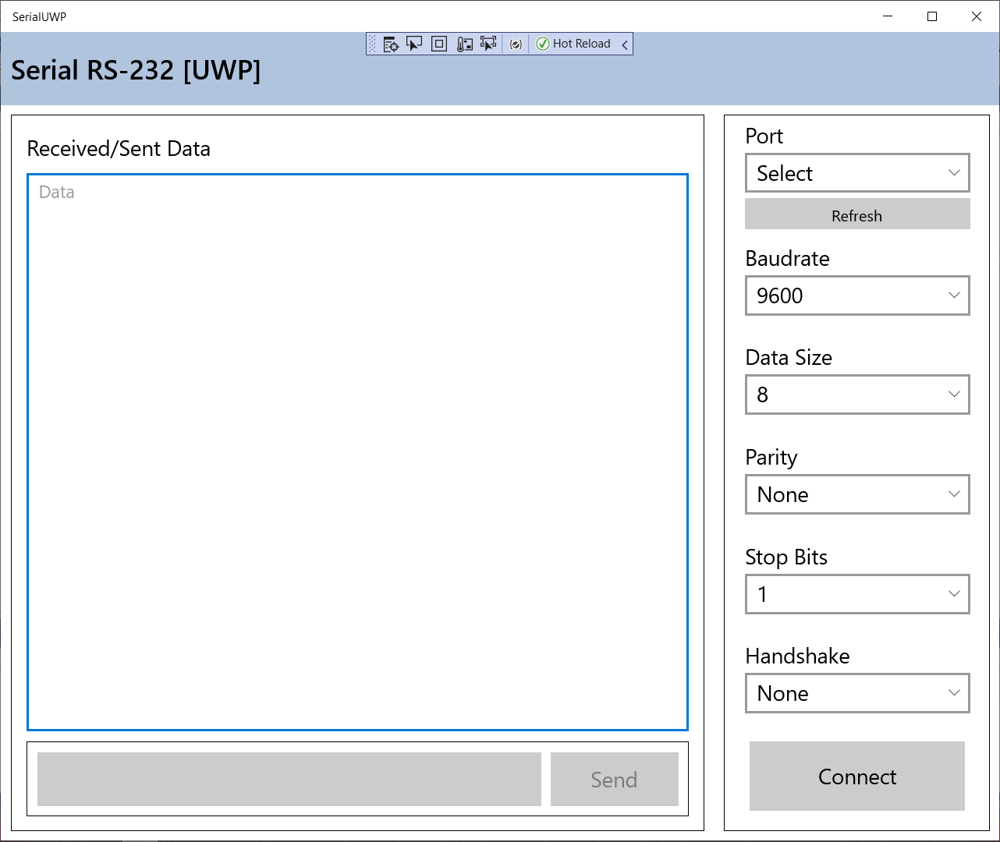

# SerialUWP

## Build Code

1. Start Microsoft Visual Studio and select **File** \> **Open** \> **Project/Solution**.
2. Double-click the Visual Studio Solution (.sln) file.
4. Press Ctrl+Shift+B, or select **Build** \> **Build Solution**.

## Run the code

To run this sample after building it, press F5 (run with debugging enabled) or Ctrl+F5 (run without debugging enabled) from Visual Studio. (Or select the corresponding options from the Debug menu.)

## GUI-Layout

## References
https://www.c-sharpcorner.com/article/serial-class-per-universal-windows-platform-part-one/
